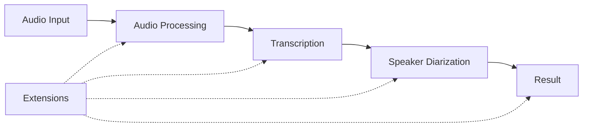

# Core Architecture

## Overview

PyHearingAI converts audio to text with speaker identification. Simple to use, easy to extend.

## 1. Design Philosophy

```
"Make simple things simple and complex things possible."
```

- **Simple by default** - One line for common use cases
- **Extensible by design** - Easy to add new models and formats
- **Progressive complexity** - Start simple, add features as needed

## 2. Core Components



## 3. User API

### 3.1 Simple API
```python
# One line for common case
result = transcribe("meeting.mp3")
print(result.text)
result.save("transcript.txt")
```

### 3.2 Advanced API
```python
# Configure models
result = transcribe(
    "meeting.mp3",
    transcriber={
        "name": "whisper-large",
        "language": "en"
    },
    diarizer={
        "name": "pyannote",
        "min_speakers": 2
    }
)

# Track progress for long files
def on_progress(info):
    print(f"{info['stage']}: {info['progress']:.0%}")
    
result = transcribe("long_file.mp3", progress_callback=on_progress)

# Reuse resources for multiple files
with pipeline_session() as session:
    result1 = session.transcribe("file1.mp3")
    result2 = session.transcribe("file2.mp3")
```

## 4. Extension System

### 4.1 Extending Models
```python
# Add a custom transcription model
@register_transcriber("my-model")
def my_transcriber(audio, config=None):
    # Process audio
    return {"text": "...", "segments": [...]}

# Use your model
result = transcribe("audio.mp3", transcriber="my-model")
```

### 4.2 Custom Processing
```python
# Add custom audio preprocessing
@register_processor("noise-reduction")
def reduce_noise(audio, config=None):
    # Remove noise
    return processed_audio

# Add custom output format
@register_format(".myformat")
def my_format(result, options=None):
    # Format the result
    return formatted_text
```

## 5. Implementation Strategy

### 5.1 Core Function
```python
def transcribe(audio, **options):
    # 1. Load and validate the audio
    audio_data = load_audio(audio)
    
    # 2. Process audio (conversion, normalization)
    processed = process_audio(audio_data, options)
    
    # 3. Transcribe audio
    transcript = run_transcription(processed, options)
    
    # 4. Identify speakers
    speakers = run_diarization(processed, options)
    
    # 5. Combine results
    return create_result(transcript, speakers)
```

### 5.2 Extension Registry
```python
# Registry for extensions
_TRANSCRIBERS = {}
_DIARIZERS = {}
_PROCESSORS = {}
_FORMATS = {}

# Registration decorators
def register_transcriber(name):
    def decorator(func):
        _TRANSCRIBERS[name] = func
        return func
    return decorator
```

## 6. Project Structure
```
src/pyhearingai/
├── __init__.py     # Public API
├── pipeline.py     # Core pipeline
├── models.py       # Model integrations
├── processing.py   # Audio processing
├── outputs.py      # Output formats
└── extensions/     # Extension plugins
```

## 7. Configuration & Error Handling

### 7.1 Configuration
```python
# Environment variables
OPENAI_API_KEY=xxx
HUGGINGFACE_API_KEY=xxx

# Or programmatically
pyhearingai.configure(openai_api_key="xxx")
```

### 7.2 Error Handling
```python
try:
    result = transcribe("audio.mp3")
except TranscriptionError as e:
    if e.partial:
        # Use partial results
        print(e.partial.text)
``` 