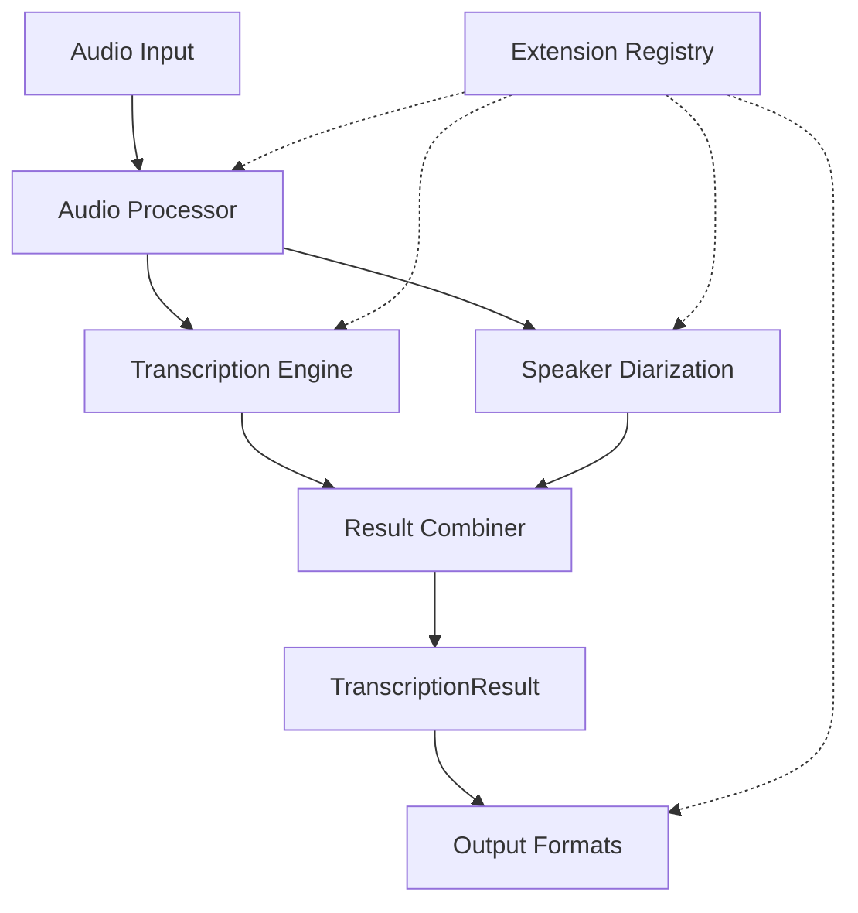

# Solution Design

## Overview

PyHearingAI provides audio transcription and speaker identification with a simple, extensible API. This document outlines the detailed design of the solution.

## 1. Core Components



## 2. Main API

```python
def transcribe(
    audio: Union[str, Path, bytes, IO],
    transcriber: Union[str, dict] = "default",
    diarizer: Union[str, dict] = "default",
    output_format: str = None,
    progress_callback: Callable = None
) -> TranscriptionResult:
    """
    Transcribe audio with speaker identification.
    
    Args:
        audio: Path to audio file, file-like object, or bytes
        transcriber: Transcription model name or config dict
        diarizer: Diarization model name or config dict
        output_format: Format to save results (determined from extension if None)
        progress_callback: Function to report progress (receives dict with stage and progress)
        
    Returns:
        TranscriptionResult object with transcript and speaker information
        
    Raises:
        AudioProcessingError: If audio cannot be processed
        TranscriptionError: If transcription fails
        DiarizationError: If speaker identification fails
    """
```

## 3. Advanced API

```python
@contextmanager
def pipeline_session(
    transcriber: Union[str, dict] = "default",
    diarizer: Union[str, dict] = "default",
    **options
):
    """
    Create a reusable pipeline session for multiple transcriptions.
    
    Args:
        transcriber: Transcription model name or config dict
        diarizer: Diarization model name or config dict
        options: Additional options for the pipeline
        
    Yields:
        Session object with transcribe method
    """
    # Initialize models and resources
    try:
        # Create session object
        session = Session(transcriber, diarizer, **options)
        yield session
    finally:
        # Clean up resources
        session.close()
```

## 4. Result Object

```python
class TranscriptionResult:
    """Holds transcription results with speaker information."""
    
    text: str  # Complete transcript
    speakers: List[str]  # List of speaker names/ids
    segments: List[Segment]  # Detailed segment information
    
    def save(self, path: Union[str, Path], **options) -> None:
        """Save transcript to a file in the format specified by extension."""
        
    def to_dict(self) -> dict:
        """Convert result to a dictionary."""
        
    def to_str(self, format_name: str = "text") -> str:
        """Convert result to string using specified format."""
        
    @property
    def duration(self) -> float:
        """Total duration of the audio in seconds."""
```

## 5. Usage Examples

### 5.1 Basic Usage

```python
# Simple case
result = transcribe("meeting.mp3")
print(result.text)

# Save to different formats
result.save("transcript.txt")  # Plain text
result.save("transcript.srt")  # Subtitles
result.save("transcript.json")  # JSON with timestamps
```

### 5.2 Model Selection and Configuration

```python
# Select models by name
result = transcribe("meeting.mp3", 
                   transcriber="whisper-large",
                   diarizer="pyannote")

# Configure models with options
result = transcribe("meeting.mp3", 
                   transcriber={
                       "name": "whisper-large", 
                       "language": "en",
                       "word_timestamps": True
                   },
                   diarizer={
                       "name": "pyannote",
                       "min_speakers": 2,
                       "max_speakers": 5
                   })
```

### 5.3 Progress Tracking

```python
def progress_handler(info):
    print(f"Stage: {info['stage']}, Progress: {info['progress']:.0%}")
    
result = transcribe("long_recording.mp3", 
                   progress_callback=progress_handler)
```

### 5.4 Reusing Resources

```python
# Process multiple files efficiently
with pipeline_session(transcriber="whisper-large") as session:
    result1 = session.transcribe("meeting1.mp3")
    result2 = session.transcribe("meeting2.mp3")
```

## 6. Extension Points

### 6.1 Registering Transcribers

```python
@register_transcriber("my-custom-model")
def my_transcription_model(audio, config=None):
    """
    Custom transcription model.
    
    Args:
        audio: Processed audio data
        config: Optional configuration dictionary
        
    Returns:
        Dict with 'text' and 'segments' keys
    """
    # Your implementation here
    return {
        "text": "Full transcript...",
        "segments": [
            {"start": 0.0, "end": 2.5, "text": "Hello world"}
        ]
    }
```

### 6.2 Registering Diarizers

```python
@register_diarizer("my-diarizer")
def my_diarization_model(audio, config=None):
    """
    Custom speaker diarization model.
    
    Args:
        audio: Processed audio data
        config: Optional configuration dictionary
        
    Returns:
        List of speaker segments
    """
    # Your implementation here
    return [
        {"start": 0.0, "end": 2.5, "speaker": "speaker_0"}
    ]
```

### 6.3 Custom Audio Processing

```python
@register_processor("noise-reduction")
def reduce_noise(audio, config=None):
    """
    Custom audio preprocessing.
    
    Args:
        audio: Raw audio data
        config: Optional configuration dictionary
        
    Returns:
        Processed audio data
    """
    # Your implementation here
    return processed_audio
```

### 6.4 Custom Output Formats

```python
@register_format(".custom")
def custom_format(result, options=None):
    """
    Custom output format.
    
    Args:
        result: TranscriptionResult object
        options: Optional formatting options
        
    Returns:
        Formatted string
    """
    # Your implementation here
    return formatted_text
```

## 7. Configuration

### 7.1 API Keys

```python
# Using environment variables
OPENAI_API_KEY=xxx
HUGGINGFACE_API_KEY=xxx

# Programmatic configuration
import pyhearingai
pyhearingai.configure(
    openai_api_key="xxx",
    huggingface_api_key="xxx"
)
```

### 7.2 Default Models

```python
# Set default models for the library
pyhearingai.configure(
    default_transcriber="whisper-large",
    default_diarizer="pyannote"
)
```

## 8. Error Handling

### 8.1 Exception Hierarchy

```
BaseError
├── AudioProcessingError
├── TranscriptionError
│   └── ModelNotFoundError
├── DiarizationError
└── OutputFormatError
```

### 8.2 Partial Results

```python
try:
    result = transcribe("audio.mp3")
except TranscriptionError as e:
    if e.partial:
        # Use partial results
        print(f"Partial transcript: {e.partial.text}")
        e.partial.save("partial.txt")
```

## 9. File Organization

```
src/pyhearingai/
├── __init__.py         # Public API
├── pipeline.py         # Core pipeline implementation
├── models/
│   ├── __init__.py     # Model registry
│   ├── base.py         # Base classes
│   ├── transcribers/   # Transcription models
│   └── diarizers/      # Diarization models
├── audio/
│   ├── __init__.py     # Audio processing
│   └── processors.py   # Audio preprocessing
├── outputs/
│   ├── __init__.py     # Output format registry
│   └── formats.py      # Output format implementations
└── utils/
    ├── __init__.py
    ├── config.py       # Configuration management
    └── errors.py       # Error definitions
```

## 10. Testing Structure

```
tests/
├── test_pipeline.py    # End-to-end tests
├── test_transcribers.py # Transcription tests
├── test_diarizers.py   # Diarization tests
├── test_audio.py       # Audio processing tests
├── test_outputs.py     # Output format tests
└── fixtures/           # Test audio files
```

## 11. Performance Considerations

- **Lazy Loading**: Models are loaded only when needed
- **Resource Pooling**: Reuse model instances across calls when possible
- **Streaming**: Support for processing audio in chunks (future)
- **Caching**: Cache intermediate results for repeated operations
- **Memory Management**: Clean up resources after use